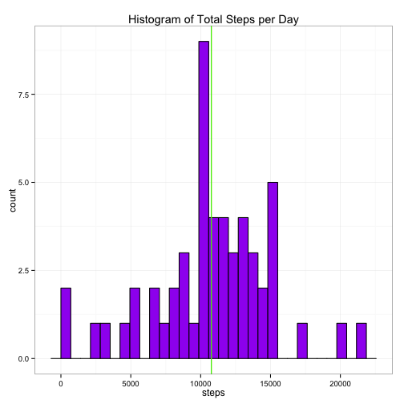
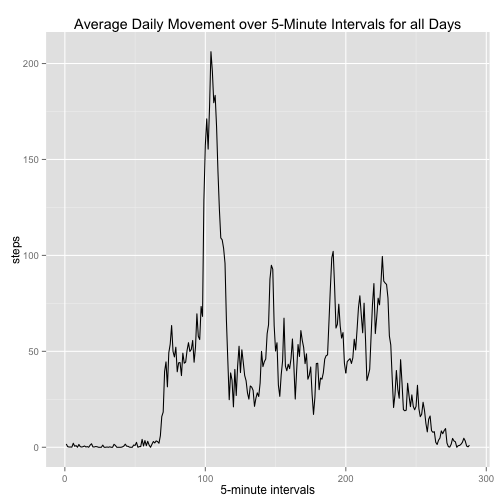
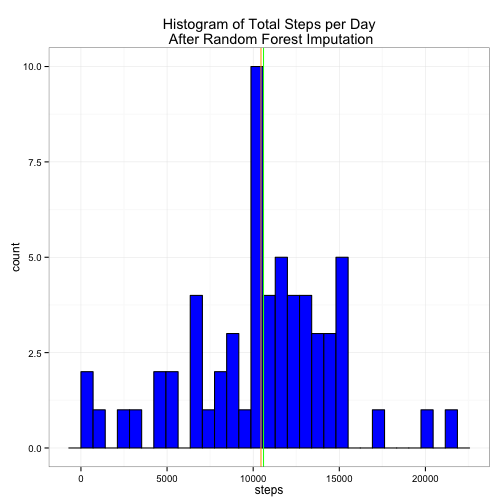
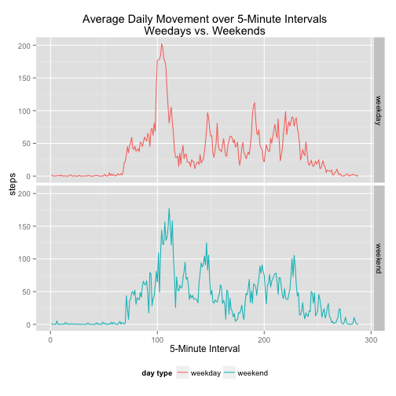

  
### Activity Monitor Exploratory Analysis   
#### Project 1 #
#### Reproducible Research #
#### Johns Hopkins Bloomberg School of Public Health @ Coursera #
#### M.Giglia October 8, 2015 #
  
  
  
Activity monitors such as the Jawbone Up, Apple Watch, and FitBit are able to record personal movement and activity data.  The following is an exploratory analysis of the personal movement data of an anonymous subject over a two month period and records the number of steps taken over five minute periods.  
  
The **activity monitor** data set may be downloaded from the following link:  
  
>Data set: [activity monitor data](https://d396qusza40orc.cloudfront.net/repdata%2Fdata%2Factivity.zip) [52k];  
>  

We'll load the data set using a temporary connection to the above hyperlink, download and unzip the file, and import it into R.  We'll name the imported data set 'import' to differentiate it from any analytic data sets we create from it.  
  

```r
fileUrl <- "https://d396qusza40orc.cloudfront.net/repdata%2Fdata%2Factivity.zip"
temp <- tempfile()
download.file(url=fileUrl, destfile = temp, method = 'curl')
import <- read.csv(unz(temp, "activity.csv"), stringsAsFactors = FALSE)
unlink(temp)
```
  
The data set is comma delimited with 17,568 observations and contains the following variables:  
  
* **steps**: Number of steps taking in a 5-minute interval (missing values are coded as **NA**)  
* **date**: The date on which the measurement was taken in YYYY-MM-DD format  
* **interval**: Identifier for the 5-minute interval in which measurement was taken  
  
***
  
After importing the data we can take a look at it's structure and the first few observations to determine if there are any attributes that should be modified.  
  

```r
str(import)
```

```
## 'data.frame':	17568 obs. of  3 variables:
##  $ steps   : int  NA NA NA NA NA NA NA NA NA NA ...
##  $ date    : chr  "2012-10-01" "2012-10-01" "2012-10-01" "2012-10-01" ...
##  $ interval: int  0 5 10 15 20 25 30 35 40 45 ...
```

```r
head(import)
```

```
##   steps       date interval
## 1    NA 2012-10-01        0
## 2    NA 2012-10-01        5
## 3    NA 2012-10-01       10
## 4    NA 2012-10-01       15
## 5    NA 2012-10-01       20
## 6    NA 2012-10-01       25
```
  
Our **date** variable is formatted as a factor variable, but it would be better to actually have it formatted as a date.  We'll use the R package 'lubridate' to change **date** to its proper format.  We also find that the interval is recorded as an integer, this might be OK, but it's actually an ordered factor variable describing which 5-minute interval of the day that the **steps** were recorded.  Let's change this as well. Lastly let's change steps from integer to numeric in case we need to impute values with significant digits. 
  

```r
library(lubridate)
import$date <- ymd(import$date)
import$interval <- factor(import$interval, levels=unique(import$interval), labels=unique(import$interval), ordered=TRUE)
import$steps <- as.numeric(import$steps)
str(import)
```

```
## 'data.frame':	17568 obs. of  3 variables:
##  $ steps   : num  NA NA NA NA NA NA NA NA NA NA ...
##  $ date    : POSIXct, format: "2012-10-01" "2012-10-01" ...
##  $ interval: Ord.factor w/ 288 levels "0"<"5"<"10"<"15"<..: 1 2 3 4 5 6 7 8 9 10 ...
```
  
Now that we have our variables set up appropriately lets perform a quick summary to see the overall distribution of values in the data set.  
  

```r
summary(import)
```

```
##      steps             date               interval    
##  Min.   :  0.00   Min.   :2012-10-01   0      :   61  
##  1st Qu.:  0.00   1st Qu.:2012-10-16   5      :   61  
##  Median :  0.00   Median :2012-10-31   10     :   61  
##  Mean   : 37.38   Mean   :2012-10-31   15     :   61  
##  3rd Qu.: 12.00   3rd Qu.:2012-11-15   20     :   61  
##  Max.   :806.00   Max.   :2012-11-30   25     :   61  
##  NA's   :2304                          (Other):17202
```
  
From the above summary we can see the range of values for the **steps**, including that there are 2,304 missing values and a max value of 806 steps over a 5-minute interval.  From the **date** variable we observe that the experiment was conducted over the two month period from October 1, 2012 to November 30, 2012, which is exactly 61 days as indicated by the frequency of the ordered **interval** factor levels.  

Next we'll make our first analytic data set that is a *melt* of our original 'import' set, we'll call this new data set 'main.'  The structure of the new data set will look the same, but by *melting* it with the reshape2 package in R it will allow us to *cast* it back into any type of summarized data we'd like.  
  

```r
library(reshape2)
main <- melt(import, id.vars = c("date","interval"), measure.vars = c("steps"))
str(main)
```

```
## 'data.frame':	17568 obs. of  4 variables:
##  $ date    : POSIXct, format: "2012-10-01" "2012-10-01" ...
##  $ interval: Ord.factor w/ 288 levels "0"<"5"<"10"<"15"<..: 1 2 3 4 5 6 7 8 9 10 ...
##  $ variable: Factor w/ 1 level "steps": 1 1 1 1 1 1 1 1 1 1 ...
##  $ value   : num  NA NA NA NA NA NA NA NA NA NA ...
```

```r
head(main)
```

```
##         date interval variable value
## 1 2012-10-01        0    steps    NA
## 2 2012-10-01        5    steps    NA
## 3 2012-10-01       10    steps    NA
## 4 2012-10-01       15    steps    NA
## 5 2012-10-01       20    steps    NA
## 6 2012-10-01       25    steps    NA
```
  
***
  
Now we're ready to begin our analysis.
  
First let's look at the distribution of total steps taken per day and find the mean and median for the total steps in a day by *recasting* our main data set as the sum of steps per day. Then we'll plot the resulting set in a histogram to review it's distribution.  For this initial exploration we'll ignore any missing values in the **steps** attribute.  
  

```r
tot.per.day <- dcast(main, date ~ variable, fun.aggregate = sum)
head(tot.per.day)
```

```
##         date steps
## 1 2012-10-01    NA
## 2 2012-10-02   126
## 3 2012-10-03 11352
## 4 2012-10-04 12116
## 5 2012-10-05 13294
## 6 2012-10-06 15420
```

```r
tot.per.day.summary <- summary(tot.per.day)
tot.per.day.summary
```

```
##       date                steps      
##  Min.   :2012-10-01   Min.   :   41  
##  1st Qu.:2012-10-16   1st Qu.: 8841  
##  Median :2012-10-31   Median :10765  
##  Mean   :2012-10-31   Mean   :10766  
##  3rd Qu.:2012-11-15   3rd Qu.:13294  
##  Max.   :2012-11-30   Max.   :21194  
##                       NA's   :8
```

```r
library(ggplot2)
g <- ggplot(data=tot.per.day, aes(x=steps))
g <- g + geom_histogram(fill="purple",color="black") 
g <- g + geom_vline(xintercept=mean(tot.per.day$steps, na.rm = TRUE), color="orange") 
g <- g + geom_vline(xintercept=median(tot.per.day$steps, na.rm = TRUE), color="green")
g + theme_bw() + theme(legend.position = "top") + labs(title="Histogram of Total Steps per Day")
```

```
## stat_bin: binwidth defaulted to range/30. Use 'binwidth = x' to adjust this.
```

 
  
From the above histogram we can see that most of the days' total steps are centered around the mean of ***1.076619e+04*** and the median of ***1.0765e+04***.  In fact the mean and median are so close that on the histogram above the green "median line" has overwritten the orange "mean line."  We also see that there a couple days with very few total steps, and a few days with over approximately 16,000 steps.  From the summary we also observe that there are 8 days with no recordings at all.
  
***
  
Next we'll look at the average daily activity pattern, that is the mean of the daily steps over each of the 5-minute intervals.  We'll do this to observe how our subject's activity varies over the course of a day on average.  Again we'll use the dcast function to *recast* our main data set to capture the mean per **interval**.  
  

```r
mean.per.int <- dcast(main, interval ~ variable, mean, na.rm=TRUE)
head(mean.per.int)
```

```
##   interval     steps
## 1        0 1.7169811
## 2        5 0.3396226
## 3       10 0.1320755
## 4       15 0.1509434
## 5       20 0.0754717
## 6       25 2.0943396
```
  
We'll visualize this by using a time-series plot with the 5-minute **intervals** on the x-axis and the mean **steps** across all days on the y-axis.  
  

```r
g <- ggplot(mean.per.int, aes(x=as.integer(interval), y=steps))
g + geom_line() + labs(x="5-minute intervals", title="Average Daily Movement over 5-Minute Intervals for all Days")
```

 
  
The time series shows that during the night and very early parts of the morning that there is little step activity, increasing rapidly around 6 a.m.  The most activity on average occurs at the ***104th*** 5-minute time interval.  This corresponds to the five minutes starting at ***835*** am, with an average step count of ***206.1698113***.  

***
  
We recall from our initial look at the data that there are missing values in our **steps** variable.  These may cause some bias with our calculations or summaries of the data.  First let's determine exactly how many missing values we have:  
  

```r
with(main[!complete.cases(main),]
     ,table(variable))
```

```
## variable
## steps 
##  2304
```
  
So we have ***2304*** missing values in the **steps** attribute and there are several ways that we could impute these including taking the mean/median steps for that day, the means steps for the five minute interval or another approach such as K nearest neighbors.  For this particular analysis we are going to try something a little different and use a new package called 'missForest' that uses random forests to impute the missing values.  The 'missForest' function is able to impute both numeric and categorical variables, even though we only need to impute our **steps** variable, this function should come in handy in the future!
  

```r
## install.packages('missForest')
library(missForest)
mf.impute <- missForest(data.matrix(main), verbose=TRUE, replace = TRUE)
```

```
##   missForest iteration 1 in progress...done!
##     estimated error(s): 5.760834e-08 
##     difference(s): 3.118778e-16 
##     time: 12.968 seconds
## 
##   missForest iteration 2 in progress...done!
##     estimated error(s): 5.741628e-08 
##     difference(s): 3.381749e-18 
##     time: 12.345 seconds
## 
##   missForest iteration 3 in progress...done!
##     estimated error(s): 5.746421e-08 
##     difference(s): 3.474069e-18 
##     time: 12.687 seconds
```
  
The imputed values from our random forest are stored in a data matrix as an attribute of the mf.impute object.  The data matrix stripped our factor variables of their labels and used used their numeric matrix form only as can be seen from the first few observations.  
  

```r
head(mf.impute$ximp)
```

```
##            date interval variable      value
## [1,] 1349049600        1        1 3.76585387
## [2,] 1349049600        2        1 0.33599971
## [3,] 1349049600        3        1 0.04249971
## [4,] 1349049600        4        1 0.06472193
## [5,] 1349049600        5        1 0.04249971
## [6,] 1349049600        6        1 0.18992920
```
  
So we'll want to reapply the formatting that was originally present prior to the imputation by changing the data matrix back into a data frame, then passing back the class and format back to the **date** variable and then reapply the factor levels and labels for **interval** and **variable**.  
  

```r
## Capture the imputed data set into a dataframe and restore the variable types and formats
main.impute <- as.data.frame(mf.impute$ximp)

## Change the class of date to POSIXct and reformat to YYYY-MM-DD
class(main.impute$date) <- class(main$date)
main.impute$date <- format(main.impute$date, '%Y-%m-%d')
main.impute$date <- ymd(main.impute$date)

## Apply the same factor levels and labels to interval as the original main set
no.of.levels <- length(levels(main$interval))
main.impute$interval <- factor(main.impute$interval, levels=c(1:no.of.levels), labels=levels(main$interval), ordered=TRUE)

## Apply the same factor levels and labels to variable as the original main set
no.of.levels <- length(levels(main$variable))
main.impute$variable <- factor(main.impute$variable, levels=c(1:no.of.levels), labels=levels(main$variable))

## Check the first few obsersations 
head(main.impute)
```

```
##         date interval variable      value
## 1 2012-09-30        0    steps 3.76585387
## 2 2012-09-30        5    steps 0.33599971
## 3 2012-09-30       10    steps 0.04249971
## 4 2012-09-30       15    steps 0.06472193
## 5 2012-09-30       20    steps 0.04249971
## 6 2012-09-30       25    steps 0.18992920
```

```r
## Perform a quick summary to see that there are no longer any missing values and all of our formatting has returned.
summary(main.impute)
```

```
##       date               interval      variable         value       
##  Min.   :2012-09-30   0      :   61   steps:17568   Min.   :  0.00  
##  1st Qu.:2012-10-15   5      :   61                 1st Qu.:  0.00  
##  Median :2012-10-30   10     :   61                 Median :  0.00  
##  Mean   :2012-10-30   15     :   61                 Mean   : 36.29  
##  3rd Qu.:2012-11-14   20     :   61                 3rd Qu.: 16.00  
##  Max.   :2012-11-29   25     :   61                 Max.   :806.00  
##                       (Other):17202
```
  
Now that we have our imputed **steps** values, let's see how it may have changed our distribution of total **steps** per day like we found earlier.  First we'll recast the imputed data set such that its aggregated as total **steps** per day.  
  

```r
tot.per.day <- dcast(main.impute, date ~ variable, fun.aggregate = sum)
head(tot.per.day)
```

```
##         date      steps
## 1 2012-09-30   725.7023
## 2 2012-10-01   126.0000
## 3 2012-10-02 11352.0000
## 4 2012-10-03 12116.0000
## 5 2012-10-04 13294.0000
## 6 2012-10-05 15420.0000
```

```r
tot.per.day.summary <- summary(tot.per.day)
tot.per.day.summary
```

```
##       date                steps      
##  Min.   :2012-09-30   Min.   :   41  
##  1st Qu.:2012-10-15   1st Qu.: 8355  
##  Median :2012-10-30   Median :10600  
##  Mean   :2012-10-30   Mean   :10453  
##  3rd Qu.:2012-11-14   3rd Qu.:12883  
##  Max.   :2012-11-29   Max.   :21194
```
  
Next we'll re-plot the histogram.

```r
g <- ggplot(data=tot.per.day, aes(x=steps))
g <- g + geom_histogram(fill="blue",color="black") 
g <- g + geom_vline(xintercept=mean(tot.per.day$steps, na.rm = TRUE), color="orange") 
g <- g + geom_vline(xintercept=median(tot.per.day$steps, na.rm = TRUE), color="green")
g + theme_bw() + theme(legend.position = "top") + labs(title="Histogram of Total Steps per Day\n After Random Forest Imputation")
```

```
## stat_bin: binwidth defaulted to range/30. Use 'binwidth = x' to adjust this.
```

 
  
For the most part our overall distribution for total steps per day hasn't changed all that much.  There is another day added to the very low step bin on the far left of the distribution, but it looks like most of the days were centered around 10,000 steps, including a few more days added to the tallest bin right near the mean and the median.  In our histogram picture above the mean, ***1.045273e+04***, is represented by the orange vertical line and the median, ***1.06e+04***, is represented by the green line. Compared to the distribution we observed prior to the missing value imputation, both the mean and the median has shifted slightly lower by a few hundred steps per day, but for the most part our subject is earning on average around 10,000 steps per day and only very occasionally earning more than 15,000 steps per day.  Since the distribution hasn't changed much, we can be reasonably assured in the accuracy of our imputation using the random forest technique.  
  
***  
  
Now that we have our imputed data, let's see if there are any differences in activity patterns for our subject based on if it's a weekday or a weekend.  We expect to see some differences, perhaps if our subject works in an office in a fairly stationary desk job during the week and is outside more on the weekends.  Our study is over October and November in 2012, it's possible our subject may have fall cleanup work to attend to on the weekends potentially increasing her step count more during the mid day hours than she normally would on the weekdays.  Let's first create a new variable called **weekday** that will show the day of the week that the **steps** were recorded, and then use that to create a dummy variable for the weekend we'll call **day.type** that is a 1 if it's a weekend and 0 if it's a weekend. Lastly we'll change **day.type** into a factor variable.   
  

```r
library(plyr)
## Create weekday and day.type variables
main.impute <- mutate(main.impute, weekday = weekdays(date), day.type = ifelse(weekday %in% c("Saturday","Sunday"), 1, 0))

## Change day.type into a factor variable with levels "weekday" and "weekend"
main.impute$day.type <- factor(main.impute$day.type, levels=c(0,1), labels=c("weekday","weekend"))

## Change weekday into an ordered foctor variable
main.impute$weekday <- factor(main.impute$weekday, levels = c("Monday", "Tuesday", "Wednesday", "Thursday", "Friday", "Saturday", "Sunday"), ordered = TRUE)

## View the first few observations and a summmary
head(main.impute)
```

```
##         date interval variable      value weekday day.type
## 1 2012-09-30        0    steps 3.76585387  Sunday  weekend
## 2 2012-09-30        5    steps 0.33599971  Sunday  weekend
## 3 2012-09-30       10    steps 0.04249971  Sunday  weekend
## 4 2012-09-30       15    steps 0.06472193  Sunday  weekend
## 5 2012-09-30       20    steps 0.04249971  Sunday  weekend
## 6 2012-09-30       25    steps 0.18992920  Sunday  weekend
```

```r
summary(main.impute)
```

```
##       date               interval      variable         value       
##  Min.   :2012-09-30   0      :   61   steps:17568   Min.   :  0.00  
##  1st Qu.:2012-10-15   5      :   61                 1st Qu.:  0.00  
##  Median :2012-10-30   10     :   61                 Median :  0.00  
##  Mean   :2012-10-30   15     :   61                 Mean   : 36.29  
##  3rd Qu.:2012-11-14   20     :   61                 3rd Qu.: 16.00  
##  Max.   :2012-11-29   25     :   61                 Max.   :806.00  
##                       (Other):17202                                 
##       weekday        day.type    
##  Monday   :2592   weekday:12672  
##  Tuesday  :2592   weekend: 4896  
##  Wednesday:2592                  
##  Thursday :2592                  
##  Friday   :2304                  
##  Saturday :2304                  
##  Sunday   :2592
```
  
Now we'll *recast* our data set by aggregating the mean steps per 5-minute **interval** and the **day.type**.  
  

```r
mean.steps.int.day <- dcast(main.impute, day.type + interval ~ variable, mean)
head(mean.steps.int.day)
```

```
##   day.type interval      steps
## 1  weekday        0 1.84745764
## 2  weekday        5 0.40943780
## 3  weekday       10 0.15943780
## 4  weekday       15 0.18216507
## 5  weekday       20 0.09125598
## 6  weekday       25 0.54580144
```
  
Now that we have our final analytic data set let's see how the daily activity pattern varies between weekdays and the weekends by plotting a time series panel plot.  
  

```r
g <- ggplot( mean.steps.int.day, aes(x=as.integer(interval), y=steps))
g <- g + geom_line(aes(color = mean.steps.int.day$day.type))
g <- g + facet_grid(day.type ~ .) + theme(legend.position="bottom")
g + labs(x = "5-Minute Interval", title = "Average Daily Movement over 5-Minute Intervals\nWeedays vs. Weekends", color = "day type")
```

 
  
Looking at the daily activity patterns in this way we're able to see that our subject is perhaps waking up later and working out at different times as opposed to always right around ***835*** am during the weekdays.  We see from the graph the at highest amount of activity during a five minute interval is occurring at ***910*** am on the weekends.  
  
***  
    
  
   
      
  
    
